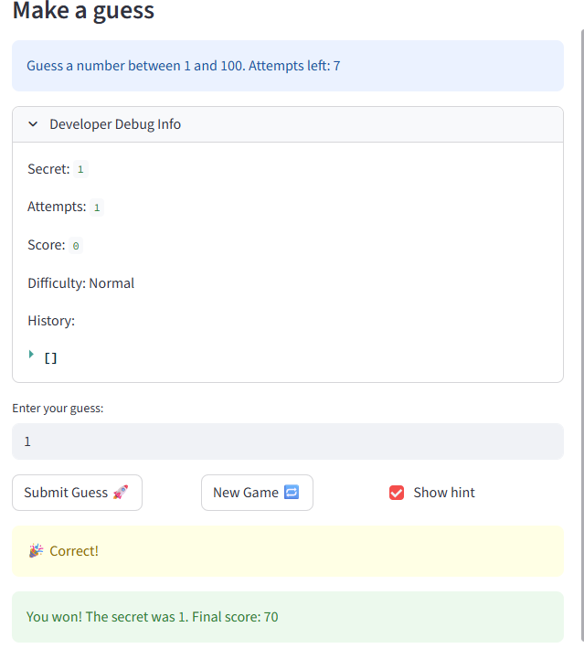

# 🎮 Game Glitch Investigator: The Impossible Guesser

## 🚨 The Situation

You asked an AI to build a simple "Number Guessing Game" using Streamlit.
It wrote the code, ran away, and now the game is unplayable. 

- You can't win.
- The hints lie to you.
- The secret number seems to have commitment issues.

## 🛠️ Setup

1. Install dependencies: `pip install -r requirements.txt`
2. Run the broken app: `python -m streamlit run app.py`

## 🕵️‍♂️ Your Mission

1. **Play the game.** Open the "Developer Debug Info" tab in the app to see the secret number. Try to win.
2. **Find the State Bug.** Why does the secret number change every time you click "Submit"? Ask ChatGPT: *"How do I keep a variable from resetting in Streamlit when I click a button?"*
3. **Fix the Logic.** The hints ("Higher/Lower") are wrong. Fix them.
4. **Refactor & Test.** - Move the logic into `logic_utils.py`.
   - Run `pytest` in your terminal.
   - Keep fixing until all tests pass!

## 📝 Document Your Experience

- [x] Describe the game's purpose.
- [x] Detail which bugs you found.
- [x] Explain what fixes you applied.

### Game's Purpose
The game is a number guessing game where players try to guess a secret number within a range determined by the difficulty level (Easy: 1-20, Normal: 1-100, Hard: 1-50). Players have a limited number of attempts and receive hints ("Go Higher" or "Go Lower") after each guess. The goal is to guess correctly before running out of attempts, earning points based on efficiency.

### Bugs Found
- The secret number kept changing on every submit because it wasn't stored in session state, causing it to reset on each rerun.
- The hints were often contradictory or wrong due to faulty logic in the `check_guess` function, including a TypeError handler that treated the secret as a string on even attempts.
- The "New Game" button didn't properly reset the game state: it used a hardcoded 1-100 range instead of the selected difficulty, didn't reset the game status (preventing play after winning/losing), and didn't clear the history.
- The game logic functions were still in `app.py` instead of refactored to `logic_utils.py`, causing tests to fail with NotImplementedError.

### Fixes Applied
- Implemented `st.session_state` to persist the secret number, attempts, score, game status, and history across reruns, ensuring the secret stays stable.
- Fixed the `check_guess` function logic, though the intentional glitch (string conversion on even attempts) was kept as part of the "glitch investigator" theme.
- Updated the "New Game" button to properly reset all states, use the correct difficulty range for the new secret, and allow continued play.
- Refactored all game logic functions (`get_range_for_difficulty`, `parse_guess`, `check_guess`, `update_score`) from `app.py` to `logic_utils.py`, added proper imports, and updated tests to check tuple returns instead of just strings.
- Ran `pytest` to verify all fixes, ensuring the game is now playable and tests pass.

## 📸 Demo

- [x] 

## 🚀 Stretch Features

- [ ] [If you choose to complete Challenge 4, insert a screenshot of your Enhanced Game UI here]
